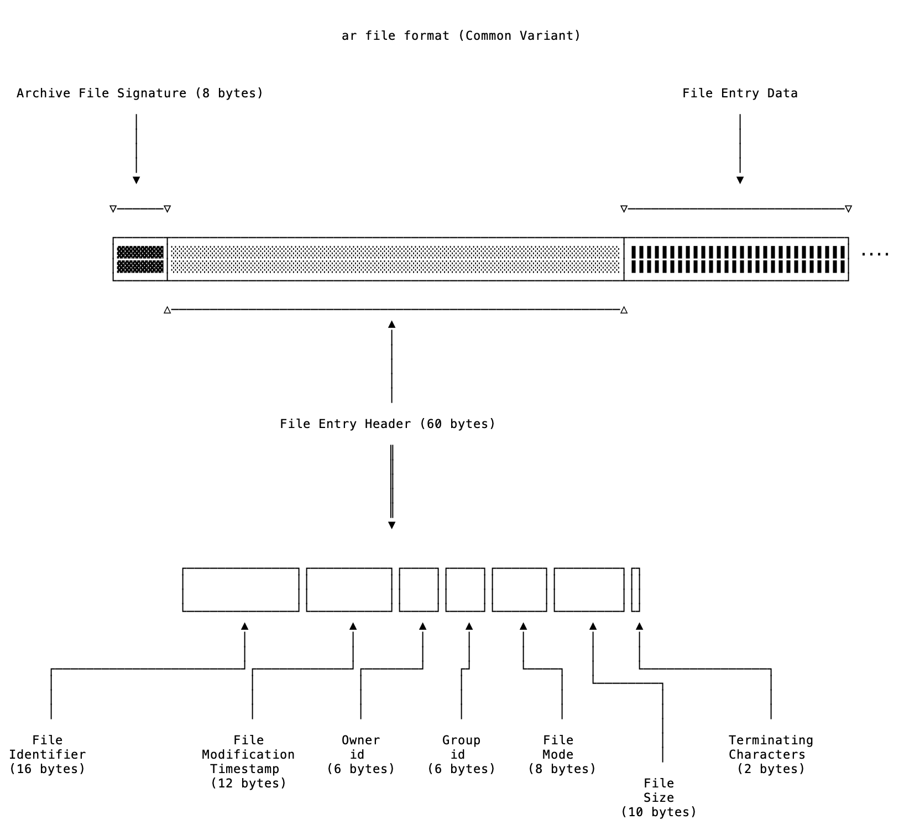

# ar-parser
Documenting the main variants of the ar file format by writing parsers for each of them.
You can find all the details regarding the project [here](https://www.abhirag.com/blog/ar/).

## [Common Variant](src/common_variant.rs)

